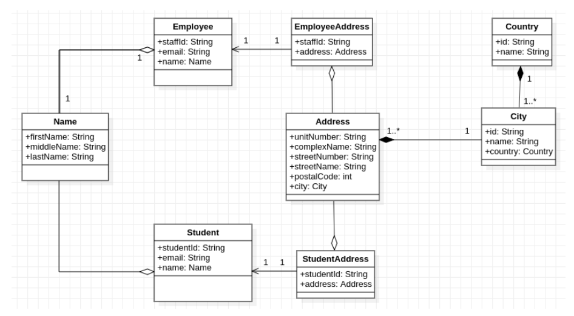

# Assessment: School Management

---

---

### Question 10

#### Sonwabile Gxoyiya -

For the Name Entity if there was a need to add a field or change the field type it means the data needs to be changed in the two classes Employee and Student.

#### Siyamtanda Tonjeni -

#### Siyamtanda Tonjeni -

#### Siyamtanda Tonjeni -

#### Nikiwe Mkontshwana -
 Security to be added so that the code may not be vulnerable

#### Abongile Tshopi -

